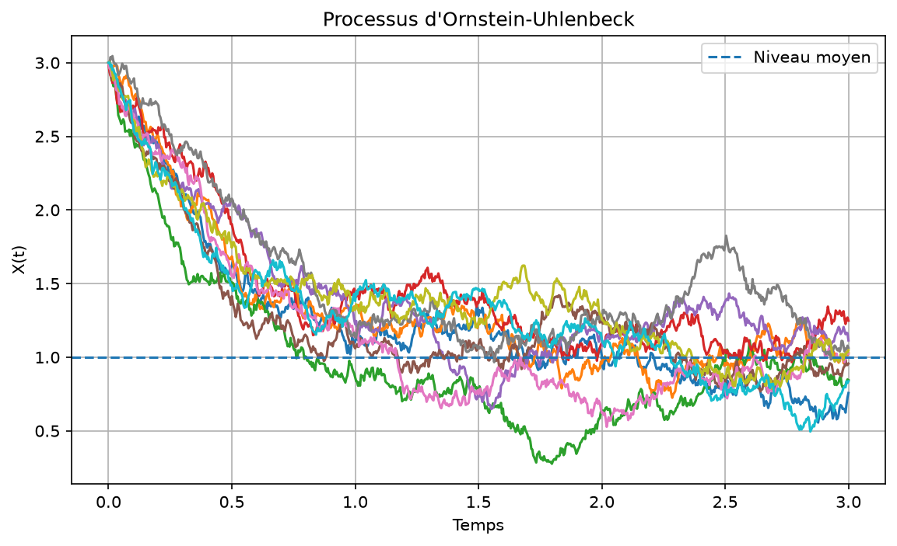
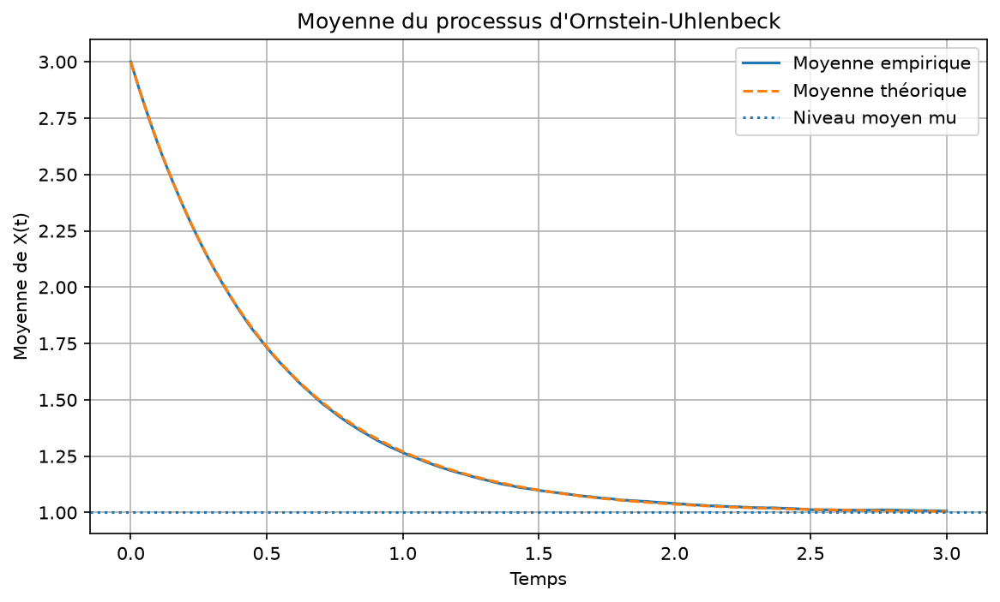
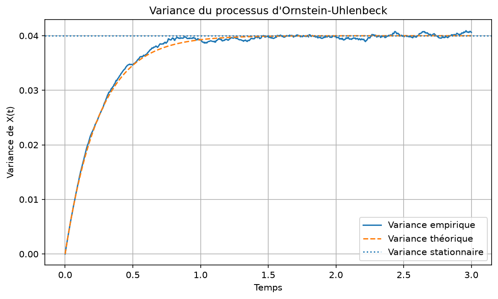
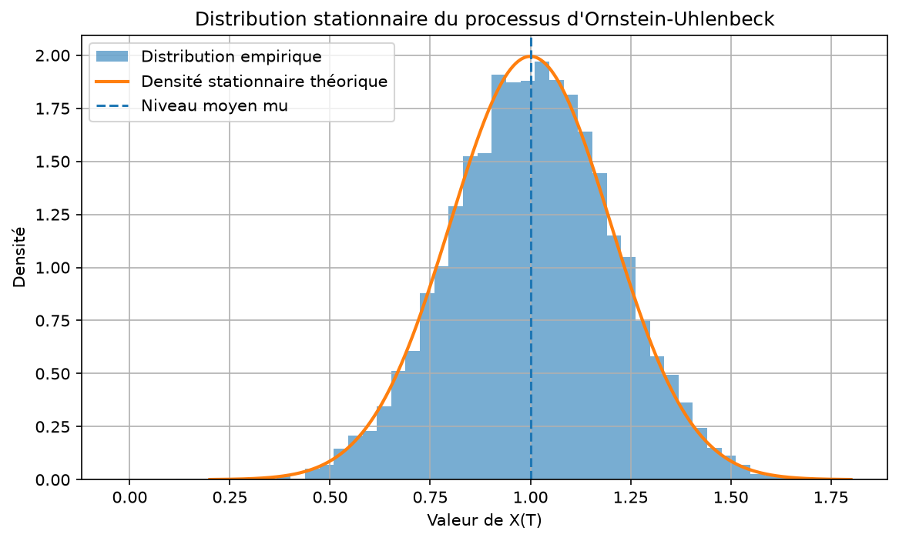
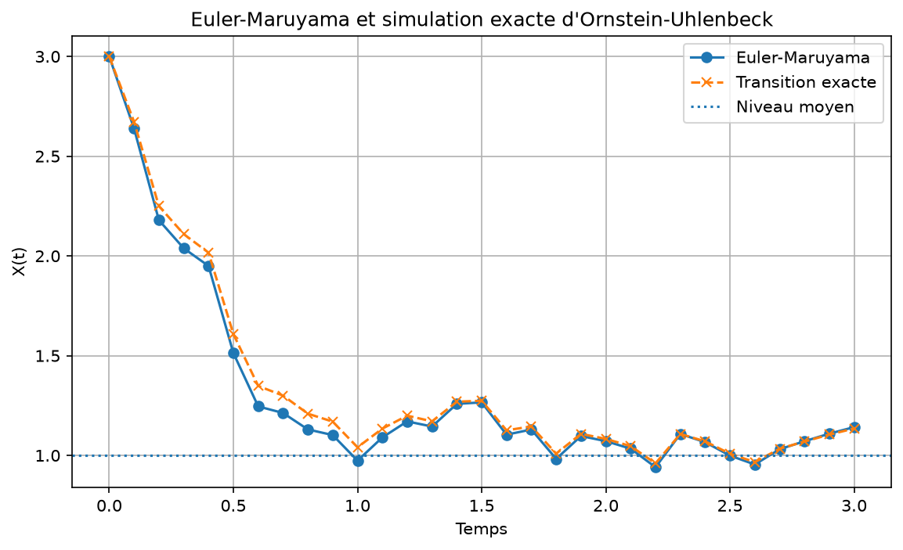
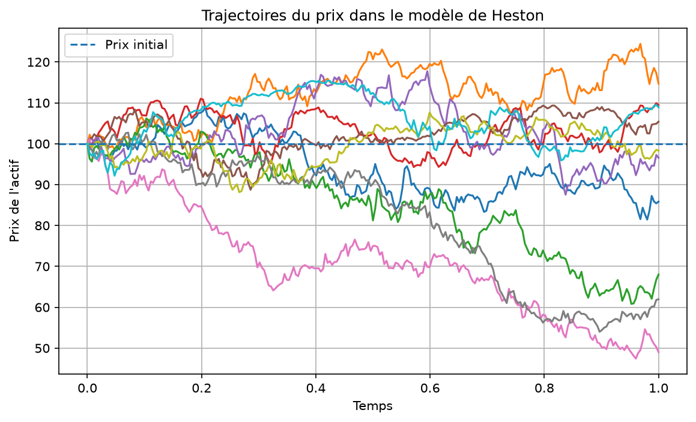
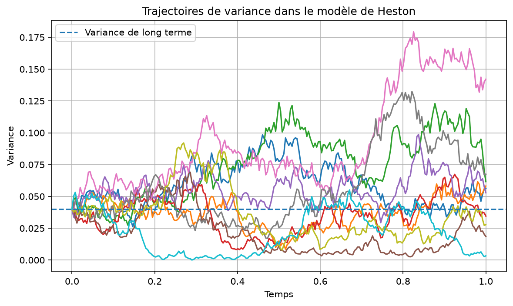
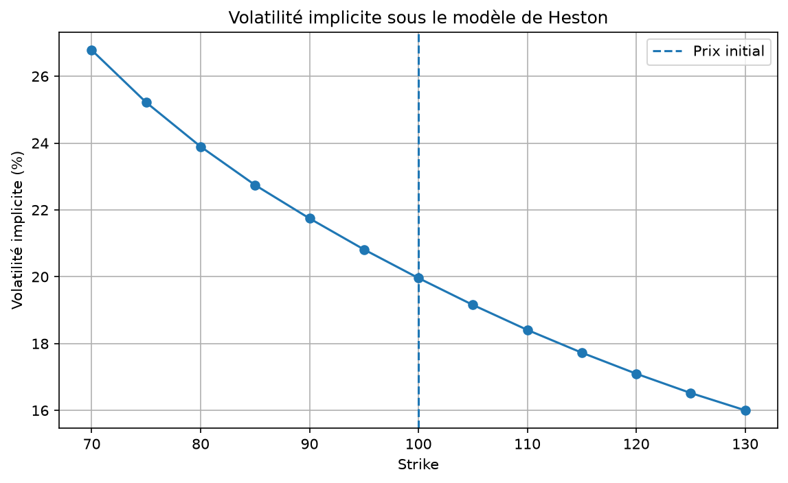

# Simulation d’équations différentielles stochastiques

Projet pédagogique en Python consacré à la simulation numérique de processus stochastiques utilisés en finance quantitative.

Le projet étudie principalement le processus d’Ornstein–Uhlenbeck, puis introduit le modèle de Heston comme extension.

L’objectif est de relier :

- les équations mathématiques ;
- leur interprétation probabiliste ;
- leur implémentation en Python ;
- leur vérification par simulation.

## Objectifs du projet

- comprendre la structure d’une équation différentielle stochastique ;
- simuler un processus avec le schéma d’Euler–Maruyama ;
- étudier le retour à la moyenne du processus d’Ornstein–Uhlenbeck ;
- comparer les résultats simulés aux résultats théoriques ;
- comparer Euler–Maruyama à la transition exacte du processus OU ;
- estimer les paramètres d’un processus OU à partir de données synthétiques ;
- introduire une variance stochastique avec le modèle de Heston ;
- générer des chocs browniens corrélés ;
- utiliser Monte-Carlo pour calculer des prix d’options.

---

## 1. Processus d’Ornstein–Uhlenbeck

Le processus d’Ornstein–Uhlenbeck est défini par l’équation :

```text
dX(t) = theta × (mu - X(t)) × dt + sigma × dW(t)
```

avec :

- `X(t)` : valeur du processus à la date `t` ;
- `mu` : niveau moyen de long terme ;
- `theta` : vitesse de retour vers la moyenne ;
- `sigma` : intensité du bruit aléatoire ;
- `W(t)` : mouvement brownien.

Le processus est attiré vers le niveau `mu`, tout en étant continuellement perturbé par des chocs aléatoires.

### Schéma d’Euler–Maruyama

Pour simuler le processus, on découpe le temps en petits intervalles `dt` et on utilise :

```text
X(k+1) = X(k)
         + theta × (mu - X(k)) × dt
         + sigma × sqrt(dt) × Z(k)
```

où :

```text
Z(k) suit une loi normale de moyenne 0 et de variance 1.
```

La mise à jour contient deux parties :

- un terme déterministe qui ramène le processus vers `mu` ;
- un terme aléatoire provenant du mouvement brownien.

---

## 2. Propriétés théoriques du processus OU

La moyenne théorique du processus est :

```text
E[X(t)] = mu + (X(0) - mu) × exp(-theta × t)
```

Lorsque le temps devient grand :

```text
E[X(t)] tend vers mu.
```

La variance théorique est :

```text
Var(X(t))
=
sigma² / (2 × theta)
×
(1 - exp(-2 × theta × t))
```

À long terme :

```text
Var(X(t)) tend vers sigma² / (2 × theta).
```

Le processus possède alors une distribution stationnaire normale :

```text
Moyenne stationnaire = mu

Variance stationnaire = sigma² / (2 × theta)
```

Le projet vérifie numériquement ces résultats en comparant :

- la moyenne empirique des trajectoires à la moyenne théorique ;
- la variance empirique à la variance théorique ;
- l’histogramme des valeurs finales à la densité normale stationnaire.

---

## 3. Comparaison avec la transition exacte

Pour le processus d’Ornstein–Uhlenbeck, la transition exacte entre deux dates est connue :

```text
X(t + dt)
=
mu
+
(X(t) - mu) × exp(-theta × dt)
+
sigma
×
sqrt(
    (1 - exp(-2 × theta × dt))
    /
    (2 × theta)
)
× Z
```

où `Z` suit une loi normale centrée réduite.

Le projet compare cette simulation exacte au schéma d’Euler–Maruyama.

Cette comparaison permet d’observer que :

- Euler–Maruyama introduit une erreur de discrétisation ;
- cette erreur est plus visible lorsque le pas de temps est grand ;
- l’approximation s’améliore lorsque le pas de temps diminue.

---

## 4. Calibration naïve du processus OU

Le projet contient également une calibration simple du processus d’Ornstein–Uhlenbeck.

Des trajectoires synthétiques sont d’abord générées avec des paramètres connus. On cherche ensuite à retrouver ces paramètres en utilisant uniquement les valeurs observées.

La prédiction moyenne d’une transition est :

```text
X_prédit(k+1)
=
X(k)
+
theta × (mu - X(k)) × dt
```

Le résidu associé est :

```text
erreur(k)
=
X(k+1)
-
X_prédit(k+1)
```

Les paramètres `theta` et `mu` sont estimés en minimisant l’erreur quadratique moyenne :

```text
MSE
=
moyenne des erreurs(k)²
```

L’optimisation est effectuée avec :

```python
scipy.optimize.minimize
```

Une fois `theta` et `mu` estimés, la volatilité est obtenue à partir de la dispersion des résidus :

```text
sigma estimé
=
sqrt(
    moyenne des erreurs(k)²
    /
    dt
)
```

### Exemple de résultat

| Paramètre | Valeur réelle | Valeur estimée |
|---|---:|---:|
| Vitesse de retour `theta` | 1,5000 | 1,5022 |
| Niveau moyen `mu` | 1,0000 | 0,9898 |
| Volatilité `sigma` | 0,3000 | 0,3010 |

La calibration retrouve donc correctement les paramètres utilisés pour générer les données.

Cette méthode reste volontairement simple et sert principalement à comprendre le principe général de calibration d’un modèle.

---

## 5. Extension : modèle de Heston

Le modèle de Heston remplace la volatilité constante du mouvement brownien géométrique par une variance aléatoire.

Le prix de l’actif vérifie :

```text
dS(t)
=
r × S(t) × dt
+
sqrt(v(t)) × S(t) × dW_S(t)
```

La variance vérifie :

```text
dv(t)
=
kappa × (theta - v(t)) × dt
+
xi × sqrt(v(t)) × dW_v(t)
```

Les paramètres principaux sont :

- `S(t)` : prix de l’actif ;
- `v(t)` : variance instantanée ;
- `theta` : variance moyenne de long terme ;
- `kappa` : vitesse de retour vers la moyenne ;
- `xi` : volatilité de la variance ;
- `rho` : corrélation entre les chocs du prix et de la variance ;
- `r` : taux sans risque.

La volatilité instantanée est égale à :

```text
sqrt(v(t))
```

Par exemple :

```text
v(t) = 0,04
```

correspond à une volatilité de :

```text
sqrt(0,04) = 0,20 = 20 %
```

### Chocs corrélés

À partir de deux variables normales indépendantes `Z1` et `Z2`, on construit :

```text
Z_stock = Z1
```

et :

```text
Z_variance
=
rho × Z1
+
sqrt(1 - rho²) × Z2
```

Les deux variables obtenues suivent chacune une loi normale centrée réduite et leur corrélation vaut `rho`.

Lorsque `rho` est négatif, une baisse du prix est souvent associée à une hausse de la variance.

### Positivité de la variance

Le schéma numérique peut produire temporairement une variance négative.

Une troncature à zéro est donc utilisée :

```text
variance positive = max(variance, 0)
```

Cette méthode est simple et adaptée à un projet pédagogique, même si des schémas plus précis existent.

### Mise à jour du prix

Pendant un petit pas de temps, la variance est supposée constante.

Une mise à jour exponentielle inspirée du mouvement brownien géométrique est alors utilisée :

```text
S(k+1)
=
S(k)
×
exp(
    (r - variance_positive(k) / 2) × dt
    +
    sqrt(variance_positive(k) × dt)
    × Z_stock(k)
)
```

Cette écriture garantit que le prix reste strictement positif, car une exponentielle est toujours positive.

---

## 6. Pricing Monte-Carlo sous Heston

Le prix actuel d’un call européen est obtenu à partir de la moyenne actualisée de ses payoffs futurs.

Le payoff du call à maturité est :

```text
payoff = max(S(T) - K, 0)
```

Le prix théorique est :

```text
prix du call
=
facteur d’actualisation
×
espérance du payoff
```

avec :

```text
facteur d’actualisation = exp(-r × T)
```

En simulation Monte-Carlo, l’espérance est remplacée par la moyenne des payoffs simulés :

```text
prix estimé
=
exp(-r × T)
×
moyenne des max(S_T(i) - K, 0)
```

L’erreur standard de l’estimation est calculée par :

```text
erreur standard
=
écart-type des payoffs actualisés
/
sqrt(nombre de trajectoires)
```

Le projet contient également une introduction au calcul de volatilité implicite et à la visualisation d’un skew de volatilité.

Ces éléments constituent une extension du cœur principal du projet.

---

## 7. Volatilité implicite

La volatilité implicite est la volatilité qui, utilisée dans le modèle de Black-Scholes, permet de reproduire un prix d’option donné.

Le principe est :

```text
Prix Black-Scholes avec volatilité implicite
=
Prix obtenu sous Heston
```

La volatilité implicite permet de comparer les options de différents strikes avec une mesure commune.

Le projet calcule cette volatilité pour plusieurs strikes afin de visualiser un skew de volatilité.

Avec une corrélation négative entre le prix et la variance, les volatilités implicites associées aux strikes faibles peuvent être plus élevées.

---

## Structure du projet

```text
sde-simulation/
├── figures/
│   ├── heston_implied_volatility_skew.png
│   ├── heston_stock_paths.png
│   ├── heston_variance_paths.png
│   ├── ou_euler_vs_exact.png
│   ├── ou_mean_comparison.png
│   ├── ou_paths.png
│   ├── ou_stationary_distribution.png
│   └── ou_variance_comparison.png
│
├── src/
│   ├── __init__.py
│   ├── black_scholes.py
│   ├── heston.py
│   ├── heston_pricer.py
│   ├── implied_volatility.py
│   ├── ornstein_uhlenbeck.py
│   └── ou_calibration.py
│
├── correlation_demo.py
├── heston_demo.py
├── heston_pricer_demo.py
├── heston_smile_demo.py
├── ou_calibration_demo.py
├── ou_demo.py
├── ou_discretization_demo.py
├── ou_statistics_demo.py
├── README.md
└── requirements.txt
```

---

## Installation

Créer un environnement virtuel :

```powershell
python -m venv .venv
```

L’activer sous Windows PowerShell :

```powershell
.\.venv\Scripts\Activate.ps1
```

Installer les dépendances :

```powershell
python -m pip install -r requirements.txt
```

---

## Exécution des programmes

### Processus d’Ornstein–Uhlenbeck

Simulation des trajectoires :

```powershell
python ou_demo.py
```

Comparaison des statistiques empiriques et théoriques :

```powershell
python ou_statistics_demo.py
```

Comparaison entre Euler–Maruyama et la transition exacte :

```powershell
python ou_discretization_demo.py
```

Calibration naïve des paramètres :

```powershell
python ou_calibration_demo.py
```

### Modèle de Heston

Vérification de la corrélation des chocs :

```powershell
python correlation_demo.py
```

Simulation des trajectoires de prix et de variance :

```powershell
python heston_demo.py
```

Pricing Monte-Carlo d’options européennes :

```powershell
python heston_pricer_demo.py
```

Calcul des volatilités implicites :

```powershell
python heston_smile_demo.py
```

Les graphiques sont enregistrés automatiquement dans le dossier `figures`.

---

## Visualisations

### Trajectoires d’Ornstein–Uhlenbeck



### Moyenne empirique et moyenne théorique



### Variance empirique et variance théorique



### Distribution stationnaire



### Euler–Maruyama et transition exacte



### Trajectoires de prix sous Heston



### Trajectoires de variance sous Heston



### Skew de volatilité implicite



---

## Bibliothèques utilisées

- `NumPy` pour les calculs vectorisés et les simulations aléatoires ;
- `SciPy` pour les lois de probabilité, l’optimisation et la recherche de racines ;
- `Matplotlib` pour la création des graphiques.

---

## Limites du projet

Ce projet possède une finalité pédagogique et ne constitue pas une bibliothèque destinée à une utilisation professionnelle.

Ses principales limites sont :

- Euler–Maruyama introduit une erreur de discrétisation ;
- la calibration OU utilise des données synthétiques ;
- la calibration ne fournit pas d’intervalles de confiance ;
- la simulation Heston utilise une troncature simple de la variance ;
- les prix Monte-Carlo comportent une erreur statistique ;
- les paramètres ne sont pas calibrés sur des données financières réelles ;
- les dividendes et les taux d’intérêt variables ne sont pas pris en compte ;
- les performances du code ne sont pas optimisées pour des simulations de très grande taille.

---

## Compétences développées

Ce projet m’a permis de travailler les notions suivantes :

- mouvement brownien ;
- lois normales ;
- équations différentielles stochastiques ;
- schéma d’Euler–Maruyama ;
- retour à la moyenne ;
- moyenne, variance et distribution stationnaire ;
- simulation numérique ;
- calibration de paramètres ;
- optimisation numérique ;
- variables aléatoires corrélées ;
- modèle de Heston ;
- pricing Monte-Carlo ;
- erreur standard ;
- volatilité implicite ;
- organisation d’un projet Python.